# Magic Dream Bubble Website
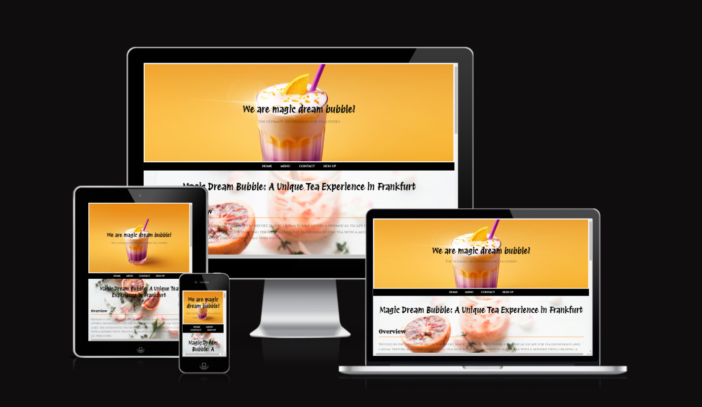

## Table of Contents

1. **Introduction**
2. **Project Overview**
   - 2.1 Purpose and Goals
   - 2.2 Target Audience
3. **User Experience (UX)**
   - 3.1 Wireframes
   - 3.2 Site Structure
   - 3.3 Design Choices
     - 3.3.1 Typography
     - 3.3.2 Colour Scheme
4. **Project Structure**
   - 4.1 Home Page (`index.html`)
   - 4.2 Menu Page (`menu.html`)
   - 4.3 Contact Page (`contactus.html`)
   - 4.4 Sign Up Page (`signup.html`)
5. **Technologies Used**
   - 5.1 HTML
   - 5.2 CSS
   - 5.3 JavaScript (Ionicons)
   - 5.4 Google Maps API
6. **Features and Functionality**
   - 6.1 Responsive Design
   - 6.2 User-friendly Navigation
   - 6.3 Interactive Elements
   - 6.4 Social Media Integration
   - 6.5 Accessibility
7. **Deployment Instructions**
8. **Future Enhancements**
9. **Conclusion**
10. **Credits**

---

## 1. Introduction

Welcome to the Magic Dream Bubble Website project. This document provides an in-depth exploration of the project, including its purpose, structure, features, technologies used, deployment instructions, future enhancements, and more.

---

## 2. Project Overview

The Magic Dream Bubble Website is a digital representation of a whimsical tea shop located in Frankfurt, Germany. Inspired by the enchanting ambiance of traditional tea houses combined with modern aesthetics, this website serves as an interactive platform for tea enthusiasts and potential customers alike. It aims to replicate the charm and allure of visiting the physical shop while offering convenient access to information, menus, contact details, and more.

### 2.1 Purpose and Goals

The primary purpose of the Magic Dream Bubble Website is to:

- **Showcase the Tea Shop**: Introduce visitors to the unique atmosphere and offerings of Magic Dream Bubble.
- **Inform and Engage**: Provide comprehensive information about the tea menu, including flavors, ingredients, and brewing methods.
- **Facilitate Communication**: Enable easy communication between customers and the tea shop through multiple channels (email, phone, contact form).
- **Promote Engagement**: Encourage visitor retention through a newsletter sign-up feature, allowing the shop to share updates, promotions, and events directly with interested customers.
- **Ensure Accessibility**: Provide a seamless and enjoyable browsing experience across various devices and screen sizes, ensuring accessibility for all users.

### 2.2 Target Audience

The target audience for the Magic Dream Bubble Website includes:

- **Tea Enthusiasts**: Individuals who appreciate high-quality teas and enjoy exploring new flavors and blends.
- **Local Residents**: People living in or visiting Frankfurt, looking for a unique tea experience in a cozy and inviting environment.
- **Online Shoppers**: Those interested in ordering tea products or merchandise online via the website's functionalities.
- **Community Members**: Social media followers and community members interested in staying updated on Magic Dream Bubble's activities, events, and promotions.

---

## 3. User Experience (UX)

Creating a seamless and engaging user experience is a key aspect of the Magic Dream Bubble Website. The UX design focuses on wireframes, site structure, design choices, typography, and color scheme.

### 3.1 Wireframes
## Desktop Device Wireframes 

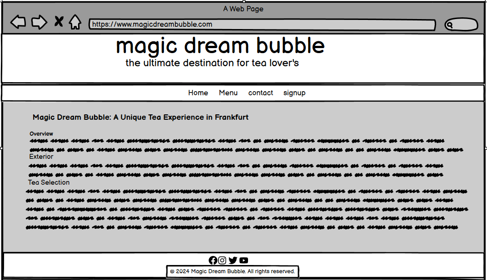


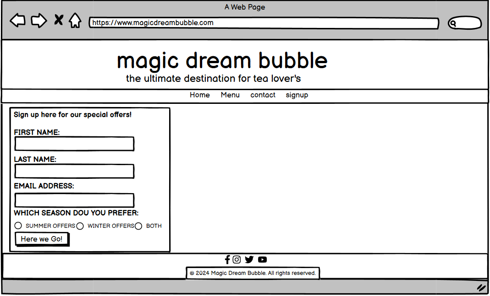

## Mobile Device Wireframes

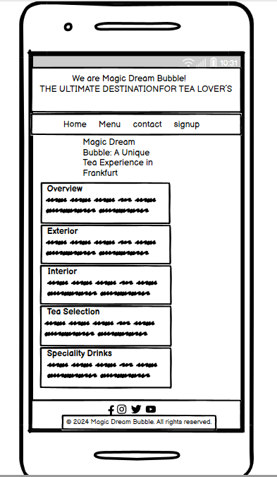 
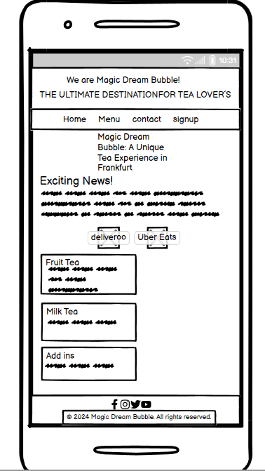 
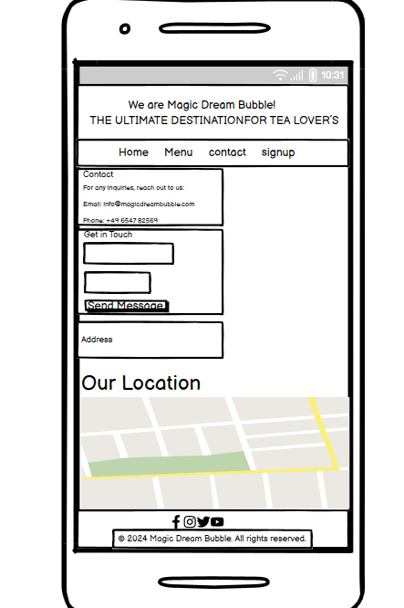 
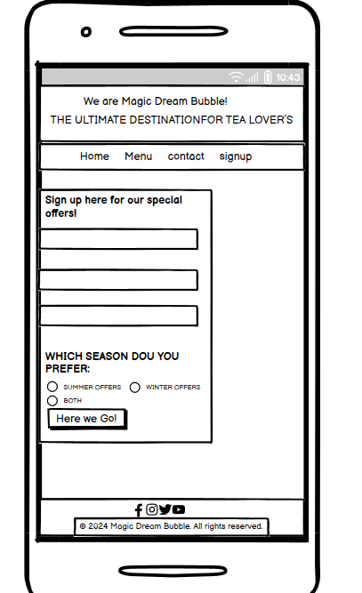 

Wireframes provide a blueprint of the website's layout, guiding the placement of elements on each page. They help visualize the structure and functionality of the site before actual development begins. For this project, Balsamiq was used to create the wireframes, ensuring a clear and efficient design process.

- **Home Page**: Includes sections such as header, navigation, welcome message, featured teas, and footer.

- **Menu Page**: Displays categories of teas with descriptions and images.
- **Contact Page**: Shows contact information, an embedded Google Map, and a contact form.
- **Sign Up Page**: Features a simple subscription form and call-to-action message.

### 3.2 Site Structure

The site structure ensures logical organization and easy navigation:

- **Home Page (`index.html`)**: The landing page with an overview and links to other pages.
- **Menu Page (`menu.html`)**: Detailed tea menu with categorized listings.
- **Contact Page (`contactus.html`)**: Contact details, map, and form for inquiries.
- **Sign Up Page (`signup.html`)**: Newsletter subscription form.

### 3.3 Design Choices

Design choices are made to align with the whimsical and enchanting theme of Magic Dream Bubble.

#### 3.3.1 Typography

- **Primary Font**: A serif font that conveys elegance and tradition.
- **Secondary Font**: A sans-serif font for readability in body text and descriptions.
- **Special Fonts**: Handwritten or cursive fonts for headings or special sections to add a magical touch.

#### 3.3.2 Colour Scheme

- **Primary Colors**: Soft pastels like lavender, mint green, and light pink to create a calming and inviting atmosphere.
- **Accent Colors**: Rich jewel tones like deep purple and emerald green for highlights and calls to action.
- **Background Colors**: Light, neutral shades to maintain readability and focus on content.

---

## 4. Project Structure

The Magic Dream Bubble Website is structured into four main pages, each designed to fulfill specific functions and enhance user engagement.

### 4.1 Home Page (`index.html`)
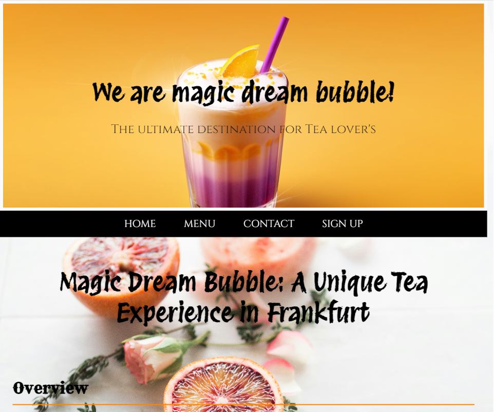

- **Purpose**: The Home Page serves as the initial point of entry, captivating visitors with a visually appealing design and welcoming message.
- **Key Elements**:
  - **Header**: Introduces Magic Dream Bubble with a captivating headline and subtext, setting the magical and inviting tone.
  - **Navigation**: Provides easy access to other main pages (Menu, Contact, Sign Up) through a clear and intuitive navigation menu.
  - **Visuals**: Incorporates thematic images or graphics that reflect the tea shop's ambiance and offerings, enticing visitors to explore further.

### 4.2 Menu Page (`menu.html`)
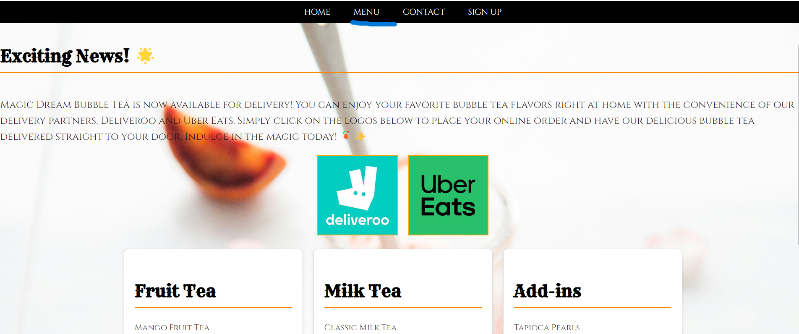
- **Purpose**: To showcase the diverse and extensive tea menu offered by Magic Dream Bubble.
- **Key Elements**:
  - **Categorization**: Organizes teas into categories such as Fruit Tea, Milk Tea, and Add-ins, each accompanied by detailed descriptions, images, and possibly customer favorites or recommendations.
  - **Descriptions**: Provides comprehensive information about each tea variety, including ingredients, flavors, brewing recommendations, and any special characteristics that make them unique.
  - **Visuals**: Uses high-quality images to visually represent each tea option, enhancing the appeal and allowing customers to make informed choices.

### 4.3 Contact Page (`contactus.html`)
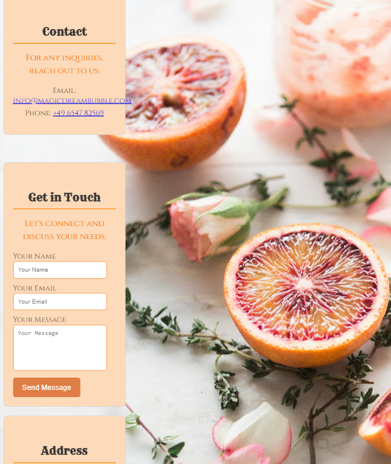
- **Purpose**: To facilitate direct communication between customers and Magic Dream Bubble.
- **Key Elements**:
  - **Contact Information**: Displays essential contact details such as email address and phone number prominently, ensuring visitors can easily reach out for inquiries or assistance.
  - **Google Map**: Embeds an interactive map to pinpoint the physical location of Magic Dream Bubble, making it simple for customers to find and visit the shop.
  - **Contact Form**: Includes a user-friendly contact form that allows visitors to send messages directly to the tea shop, ensuring efficient communication and responsiveness.

### 4.4 Sign Up Page (`signup.html`)
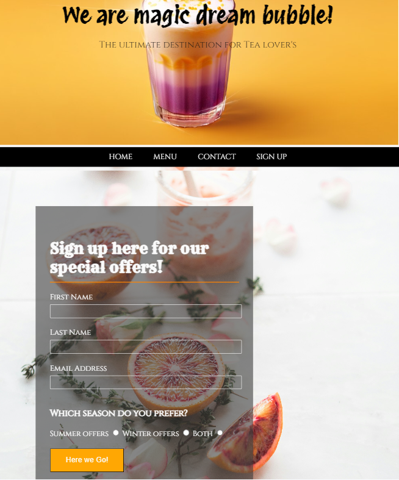
- **Purpose**: To encourage visitor engagement and retention through a newsletter sign-up feature.
- **Key Elements**:
  - **Subscription Form**: Provides a straightforward form where visitors can enter their email address and subscribe to Magic Dream Bubble's newsletter.
  - **Call-to-Action**: Includes compelling messaging that encourages visitors to sign up, highlighting the benefits of staying informed about promotions, events, and new tea arrivals.
  - **Integration**: Links the subscription form to the shop's email marketing platform or database, ensuring seamless management of subscriber lists and communications.

---

## 5. Technologies Used

The Magic Dream Bubble Website incorporates a variety of technologies to achieve its functional and aesthetic goals.

### 5.1 HTML

- **Description**: HTML (Hypertext Markup Language) forms the foundation of each webpage, providing the structure and semantic markup necessary for content presentation.
- **Role**: Ensures accessibility and search engine visibility through the proper use of tags and attributes, creating a user-friendly experience for all visitors.

### 5.2 CSS

- **Description**: CSS (Cascading Style Sheets) styles the website's elements, including layout, colors, typography, and responsive design.
- **Role**: Enhances the visual appeal of the website while maintaining consistency across different devices and screen sizes, ensuring a cohesive and professional appearance.

### 5.3 JavaScript (Ionicons)

- **Description**: JavaScript enhances the website's functionality by integrating Ionicons for decorative icons in the footer.
- **Role**: Adds visual interest and reinforces brand identity, improving overall user experience and engagement through aesthetically pleasing design elements.

### 5.4 Google Maps API

- **Description**: The Google Maps API enables the embedding of an interactive map on the Contact page, pinpointing Magic Dream Bubble's physical location.
- **Role**: Facilitates easy navigation for visitors, allowing them to locate the tea shop and plan their visit efficiently, thereby enhancing customer convenience and satisfaction.

---

## 6. Features and Functionality

The Magic Dream Bubble Website incorporates several key features designed to enrich user interaction and provide a seamless browsing experience.

### 6.1 Responsive Design

- **Description**: The website employs responsive design principles to ensure optimal viewing and interaction across various devices and screen sizes.
- **Benefits**

: Enhances accessibility and usability, accommodating users accessing the site from desktops, tablets, and smartphones without compromising functionality or aesthetics.

### 6.2 User-friendly Navigation

- **Description**: Clear and intuitive navigation menus are implemented across all pages, allowing visitors to easily navigate between different sections of the website.
- **Benefits**: Improves usability by providing straightforward access to information, menus, contact details, and other relevant content, enhancing overall user experience and satisfaction.

### 6.3 Interactive Elements

- **Description**: Interactive elements such as contact forms, newsletter sign-up forms, and clickable icons are strategically placed throughout the website.
- **Benefits**: Encourages user engagement and interaction, facilitating communication between customers and Magic Dream Bubble while promoting visitor retention and loyalty.

### 6.4 Social Media Integration

- **Description**: Links to social media platforms (Facebook, Instagram, Twitter, YouTube) are integrated into the footer of every page.
- **Benefits**: Enhances community engagement and brand visibility by enabling visitors to connect with Magic Dream Bubble on social media, stay updated on news and promotions, and share their experiences with others.

### 6.5 Accessibility

- **Description**: The website adheres to accessibility standards, including the use of alt attributes for images, semantic HTML tags, and responsive design practices.
- **Benefits**: Ensures inclusivity and accessibility for users with disabilities, providing an equal opportunity to access information and engage with content effectively.

---

## 7. Deployment Instructions

To deploy the Magic Dream Bubble Website locally or on a server, follow these instructions:

1. **Clone the Repository**:
   ```bash
   git clone https://github.com/your/repository.git
   ```

2. **Navigate to the Project Directory**:
   ```bash
   cd magic-dream-bubble-website
   ```

3. **Open Each HTML File**:
   - Open `index.html`, `menu.html`, `contactus.html`, and `signup.html` in a web browser to view the website locally.

4. **Ensure Internet Connection**:
   - Make sure your device is connected to the internet to load external resources such as Ionicons and the Google Maps API.

---

## 8. Future Enhancements

While the Magic Dream Bubble Website meets current standards and expectations, there are several areas for potential future improvements and enhancements:

- **SEO Optimization**: Enhance meta tags, descriptions, and content to improve search engine visibility and attract more organic traffic to the website.
- **Enhanced Interactivity**: Implement real-time form validation, confirmation messages, and possibly chatbot integration to enhance user engagement and responsiveness.
- **Localization**: Provide language options and currency conversion for international visitors, broadening the shop’s appeal and accessibility on a global scale.
- **Analytics Integration**: Incorporate analytics tools to track visitor behavior, gather insights, and optimize marketing strategies and website performance effectively.

---

## 9. Conclusion

The Magic Dream Bubble Website project embodies a blend of creativity, functionality, and user-centric design aimed at bringing the magical experience of a traditional tea shop to a global audience. By leveraging modern technologies and thoughtful design principles, the website strives to engage visitors, provide valuable information, and facilitate meaningful interactions between Magic Dream Bubble and its customers. With a commitment to continuous improvement and customer satisfaction, the project is poised to enhance and evolve the online presence of this fictional tea shop, ensuring its success in the digital landscape.

---

## 10. Credits

- **Project Team**: Fictional team members who conceptualized and developed the Magic Dream Bubble Website.
- **Technological Contributors**: Providers of frameworks, libraries, and APIs used in the development of the website.
- **Inspiration**: Various sources of inspiration for the design, content, and functionality of the Magic Dream Bubble Website.

---


