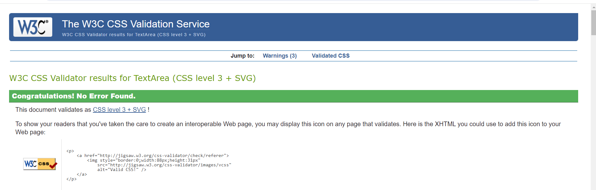
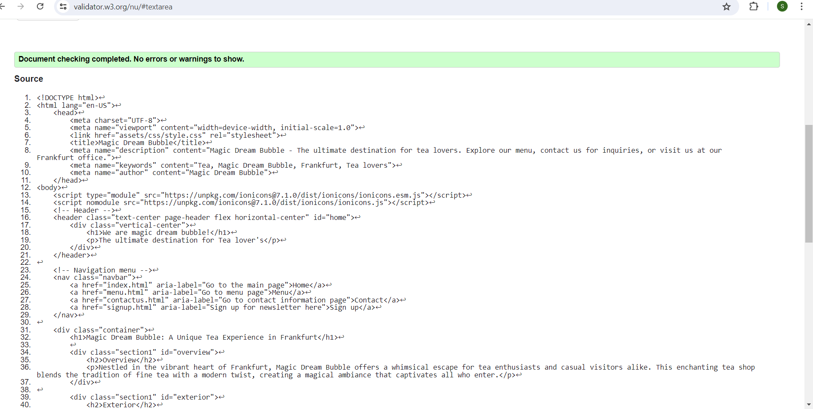
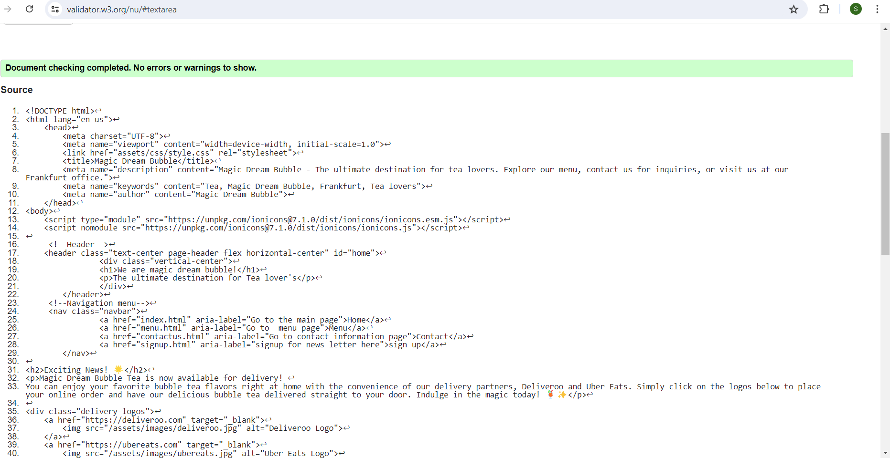
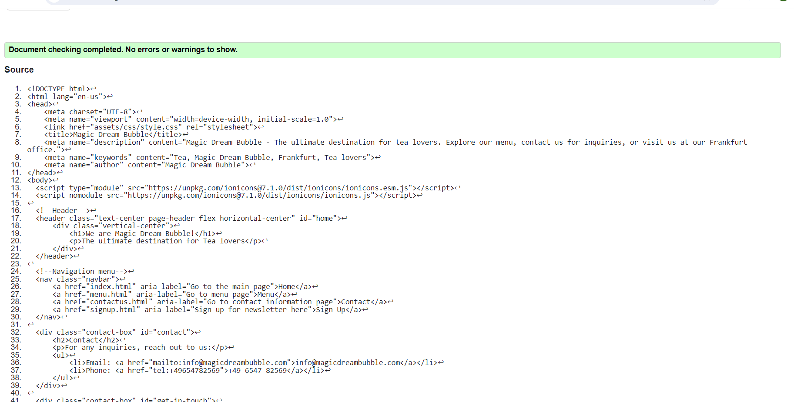
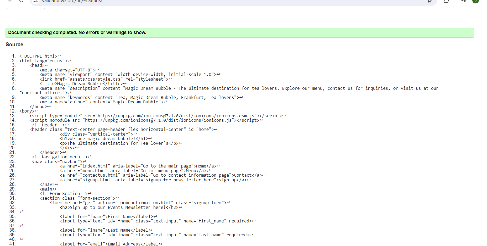
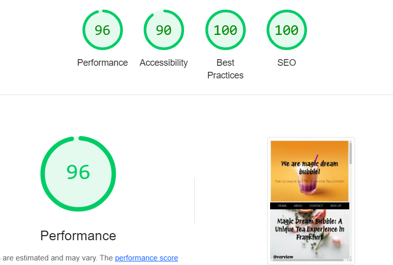

# Magic Dream Bubble Website Testing Report

## Code Validation
## The Magic dream bubble site has been passed through the W3C html Validator and the W3C CSS Validator.

### W3C HTML Validation Results
- **Index.html**: Passed with no errors or warnings.
  

- **Menu.html**: Passed with no errors or warnings.
  

- **Contactus.html**: Passed with no errors or warnings.
  

- **Signup.html**: Passed with no errors or warnings.
  

-**Formconfirmation.html**: Passed with no errors or warnings.

### W3C CSS Validation Results
- **Style.css**: Passed with no errors.

## Responsiveness Testing

### Devices and Results
#### Mobile Devices
- **Tested Devices**: iPhone 6/7 Plus, Samsung Galaxy S5/6/7, Google Pixel/Nexus 5/6
- **Results**: Passed with minor issues resolved, such as adjusting margins for navigation bar overflow on smaller screens.

#### Tablet Devices
- **Tested Devices**: Amazon Kindle Fire, Samsung Galaxy Tab 10, Apple iPad Pro
- **Results**: Passed with adjustments made to ensure form section height fills the viewport gap on specific devices.

#### Desktop Devices
- **Tested Devices**: 24” Desktop, 19” Desktop, 10” Notebook
- **Results**: Passed with enhancements to font size and content width management for optimal display.

### Testing Tools Used
- **Primary Tool**: Google Chrome Dev Tools for real-time responsive testing.
- **Additional Tool**: Responsive Design Checker for simulating various device resolutions.

## Browser Compatibility
- **Browsers Tested**: Google Chrome, Microsoft Edge, Mozilla Firefox
- **Results**: Consistent appearance and functionality across all tested browsers.

## Known Issues and Resolutions
### Resolved Issues
- Navigation bar adjustments for smaller mobile screens.
- Addressed HTML validation errors and warnings, ensuring compliance with W3C standards.

### Unresolved Issues
- Data submission confirmation without actual data storage due to project limitations.

## Additional Testing

# Lighthouse Report Summary

## Performance: 88
The performance score of 88 indicates that the website is well-optimized but has room for improvement. Key areas to focus on may include reducing the size of images, leveraging browser caching, minimizing JavaScript, and improving server response times. This score suggests that while the site loads relatively quickly, further enhancements can provide an even faster and more seamless user experience.

## Accessibility: 90
An accessibility score of 90 signifies that the website is largely accessible to users, including those with disabilities. This high score reflects strong adherence to accessibility standards such as proper use of ARIA roles, sufficient color contrast, and meaningful alt text for images. Continuous monitoring and testing with various assistive technologies can help maintain and improve this score.

## Best Practices: 100
Achieving a perfect score of 100 in best practices demonstrates that the website adheres to the latest web standards and guidelines. This includes secure handling of user data, avoiding deprecated APIs, and ensuring that the site works effectively on all devices and browsers. Maintaining this score requires staying updated with evolving web technologies and practices.

## SEO: 100
A perfect SEO score of 100 indicates that the website is fully optimized for search engines. This involves proper use of meta tags, structured data, mobile-friendliness, and fast loading times. Consistently producing high-quality content and monitoring SEO metrics will help sustain this top score, ensuring that the site remains visible and attractive to search engines.

### Peer Review Feedback
- **Feedback**: Generally positive, with implemented suggestions to improve user experience such as chronological event listing.

---

This detailed testing report provides comprehensive insights into validation results, responsiveness across various devices, browser compatibility, identified issues, and additional testing efforts conducted for the Magic Dream Bubble website project.

For further details, please refer to the [**README file**](README.md) included in the Magic Dream Bubble project documentation.
